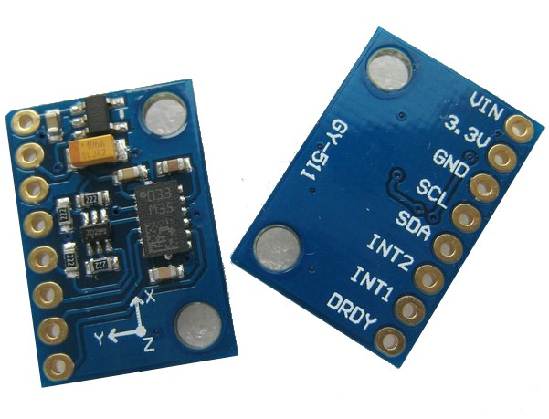

# Botparty
This is the repo for Bot Party.

# Circuit layout

### Bot 1:
LSM303 SDA - > TCA9548A SD3
LSM303 SCL - > TCA9548A SC3
LSM303 VIN -> 3V Arduino Uno
LSM303 GND -> GND on Bot's circuit board
BTN Yellow Pin -> Pin 8
BTN Green Pin -> GND on Bot's circuit board
LED Long Leg -> Pin 9
LED Short Leg -> GND on Bot's circuit board
GND on Bot's circuit board -> GND Arduino Uno
Bot Metal Sensor -> A0

### Bot 2:

LSM303 SDA - > TCA9548A SD2
LSM303 SCL - > TCA9548A SC2
LSM303 VIN -> 3V Arduino Uno
LSM303 GND -> GND on Bot's circuit board
BTN Yellow Pin -> Pin 13
BTN Green Pin -> GND on Bot's circuit board
LED Long Leg -> Pin 11
LED Short Leg -> GND on Bot's circuit board
GND on Bot's circuit board -> GND Arduino Uno
Bot Metal Sensor -> A1

### Bot3:
LSM303 SDA - > TCA9548A SD4
LSM303 SCL - > TCA9548A SC4
LSM303 VIN -> 3V Arduino Uno
LSM303 GND -> GND on Bot's circuit board
BTN Yellow Pin -> Pin 12
BTN Green Pin -> GND on Bot's circuit board
LED Long Leg -> Pin 10
LED Short Leg -> GND on Bot's circuit board
GND on Bot's circuit board -> GND Arduino Uno
Bot Metal Sensor -> A2

### TCA9548A
SCL -> SCL Arduino UNO
SDA -> SDA Arduino UNO
VIN -> 5V Arduino Uno
GND -> GND Arduino Uno

## Parts:

